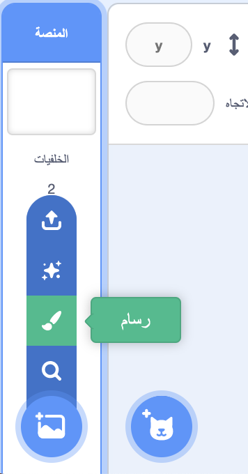
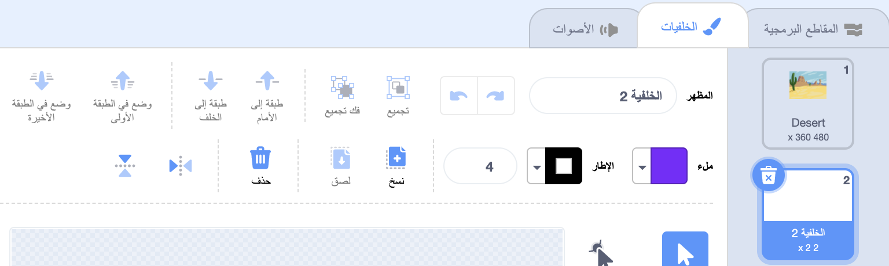
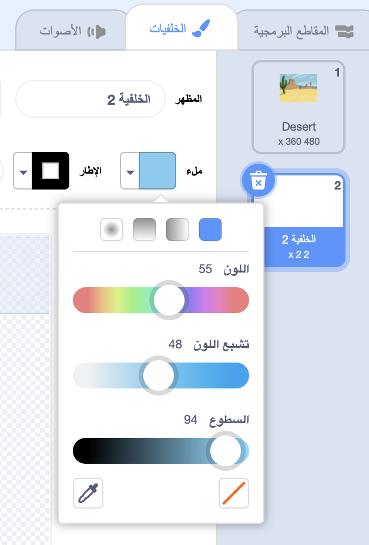
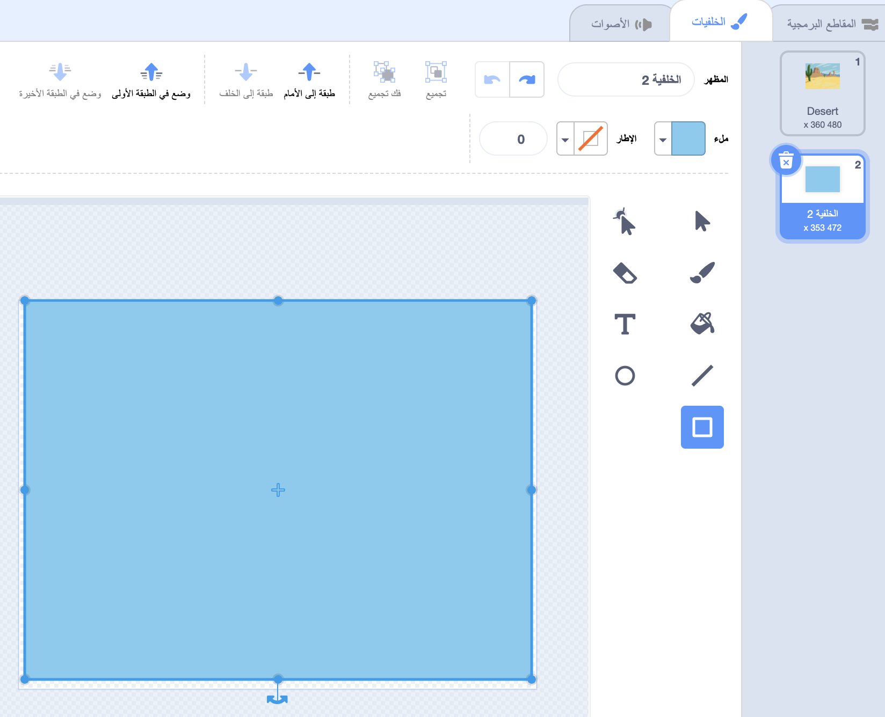

اضغط على قائمة ** اختيار خلفية** وحدد ،**رسام**.

سيتم نقلك إلى محرر رسام Scratch مع إبراز الخلفية الجديدة. إذا كان لديك خلفيات أخرى في مشروعك ، فستراها أيضًا في القائمة:

تأكد من أنه يمكنك رؤية لوحة الخلفية الكاملة ، فقد تحتاج إلى استخدام أداة **تصغير**:

لتعيين اللون الرئيسي للخلفية، انقر فوق الاداة **مستطيل** ، ثم استخدم **ملء** لتحديد لون، ثم اسحب الشكل فوق مساحة الخلفية الكاملة:

اسحب الشكل فوق مساحة الخلفية بالكامل:

