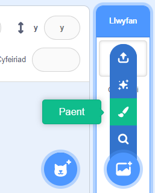
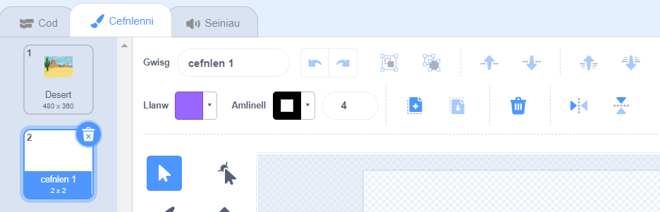
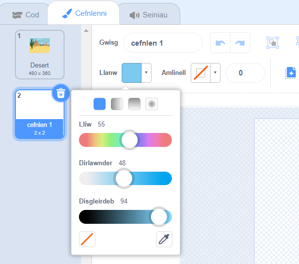
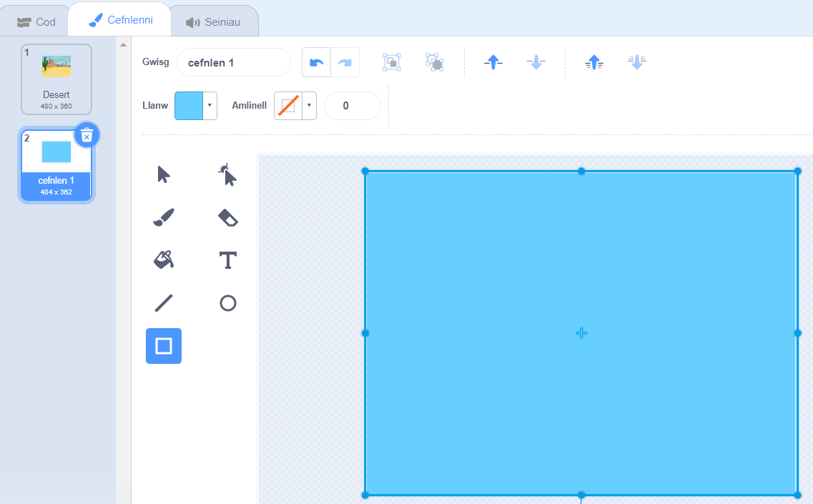

Clicia'r ddewislen **Dewiswch Gefnlen** a dewis **Paent**.

Byddi di'n mynd i'r golygydd Scratch Paint gyda'r gefnlen newydd wedi'i hamlygu. Os oes gen ti gefnlenni eraill yn dy brosiect, byddi di hefyd yn eu gweld ar y rhestr:

Gwna'n siŵr dy fod ti'n gallu gweld cynfas y gefnlen yn llawn, efallai bydd angen i ti ddefnyddio'r offeryn **Pellhau**:

I osod prif liw'r gefnlen clicia ar yr offeryn **petryal**, wedyn defnyddio'r dewiswr lliw **Llenwi** i ddewis lliw:

Llusga'r siâp dros gynfas y gefnlen lawn:

