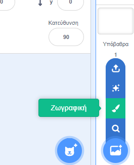
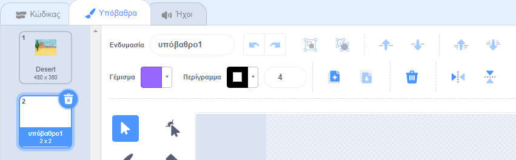
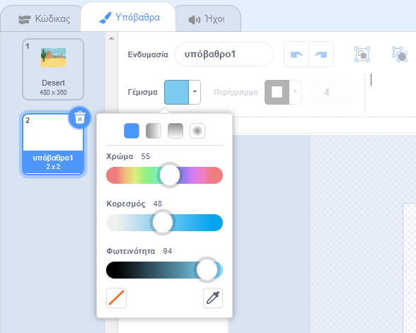
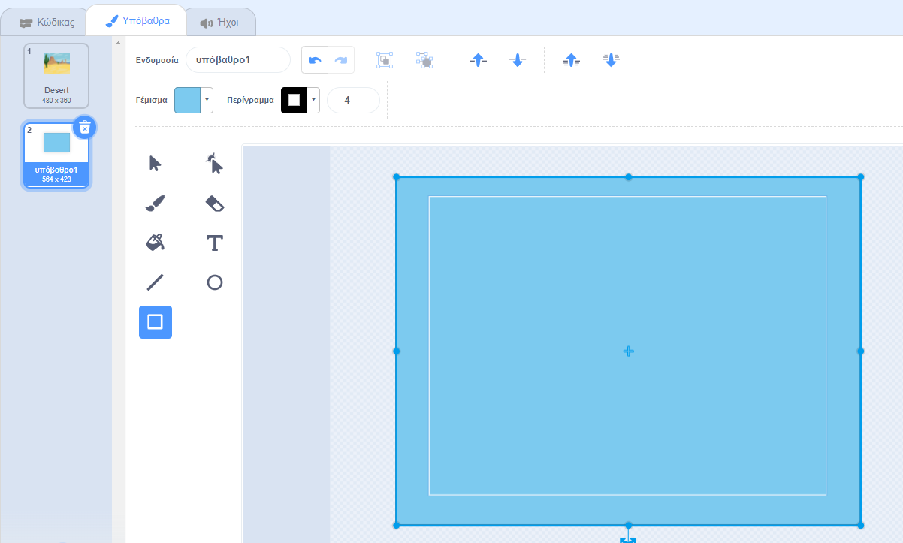

Κάνε κλικ στο μενού **Επιλέξτε Υπόβαθρο** και επίλεξε τη **Ζωγραφική**.

Θα οδηγηθείς στον επεξεργαστή Ζωγραφικής του Scratch όπου η νέα ενδυμασία υποβάθρου θα είναι επιλεγμένη. Αν υπάρχουν και άλλες ενδυμασίες υποβάθρου στο έργο σου θα εμφανίζονται επίσης στη λίστα:

Βεβαιώσου ότι μπορείς να δεις τον πλήρη καμβά υποβάθρου, ίσως χρειαστεί να χρησιμοποιήσεις το εργαλείο **Σμίκρυνση**:

Για να ορίσεις το κυρίως χρώμα του υποβάθρου, κάνε κλικ στο εργαλείο **Ορθογώνιο** και μετά χρησιμοποίησε το εργαλείο **Γέμισμα** για να επιλέξεις ένα χρώμα:

Σύρε το σχήμα πάνω στον καμβά υποβάθρου:

