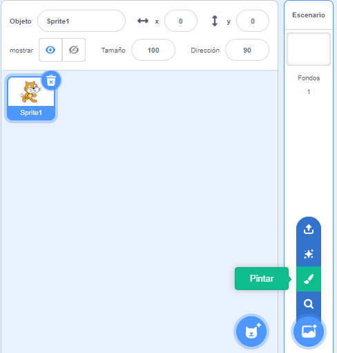
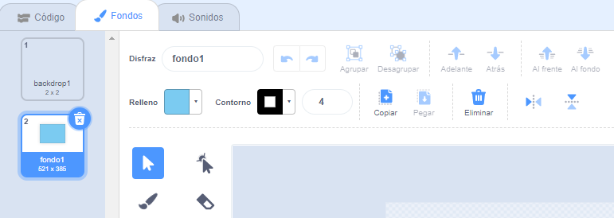
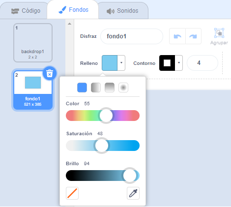
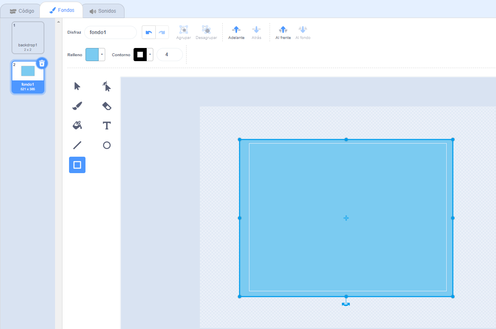

Da click al menú **Elige un fondo** y selecciona la opción **Pintar**.

Te va a llevar al editor de dibujo de Scratch con el nuevo fondo seleccionado. Si tienes otros fondos en tu proyecto también los verás en la lista:

Asegúrate de que puedes ver el fondo completo; es posible que debas usar la herramienta **Alejar**:

Para establecer el color principal del fondo, haz click en la herramienta **Rectángulo**, luego usa el selector de color **Relleno** para elegir un color:

Arrastra la forma sobre el lienzo cubriéndolo completamente:

