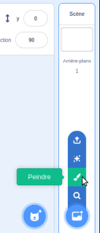
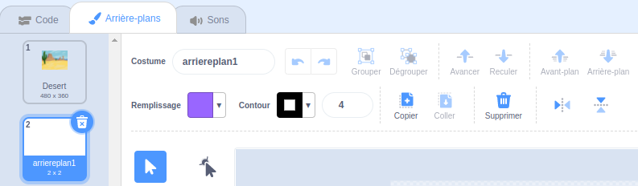
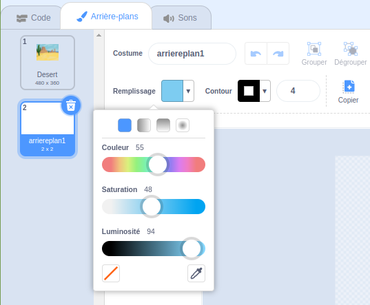
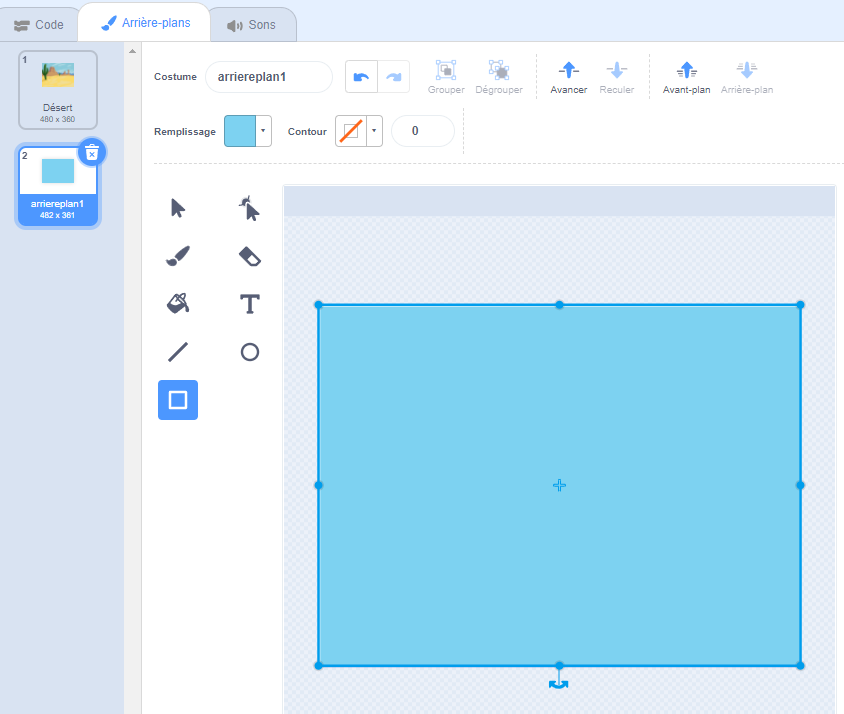

Clique sur le menu **Choisir un arrière-plan** et sélectionne **Peindre**.

Tu seras redirigé vers l'éditeur de peinture Scratch avec le nouvel arrière-plan en surbrillance. Si tu as d'autres arrière-plans dans ton projet, tu les verras également dans la liste :

Assure-toi que tu peux voir l'arrière-plan complet, tu devras peut-être utiliser l'outil **Zoom arrière** :

Pour définir la couleur principale de l'arrière-plan, clique sur l'outil **Rectangle**, puis utilise le sélecteur de couleur **Remplissage** pour sélectionner une couleur :

Fais glisser la forme sur le canevas de l'arrière-plan complet :

