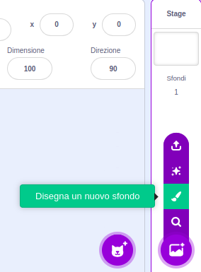
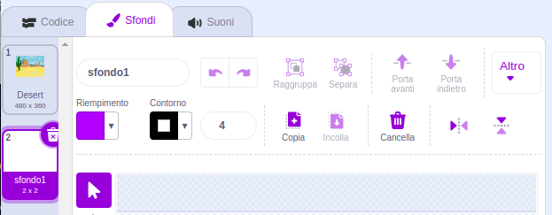
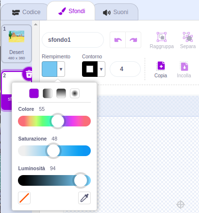
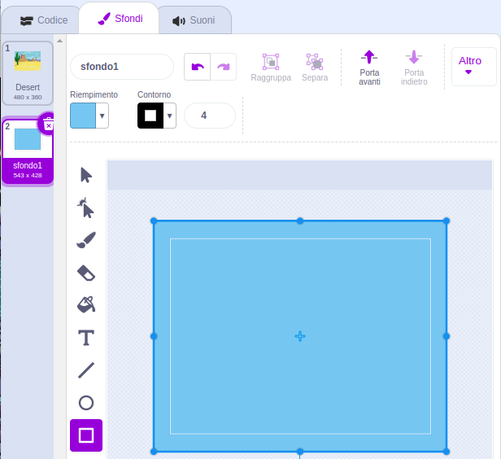

Clicca sul menu **Scegli uno Sfondo** e seleziona **Disegna un nuovo sfondo**.

Si aprirà l'editor Paint di Scratch con il nuovo sfondo selezionato. Se hai altri sfondi nel tuo progetto, li vedrai nella lista:

Assicurati di riuscire a vedere l'intera tela dello sfondo, potresti dover usare lo strumento **Zoom out** (rimpicciolisci):

Per impostare il colore principale dello sfondo, clicca sullo strumento **Rettangolo**, poi clicca su **Riempimento** per scegliere un colore:

Trascina la forma sull'intera tela dello sfondo:

