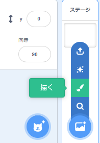
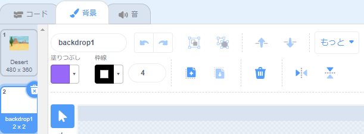
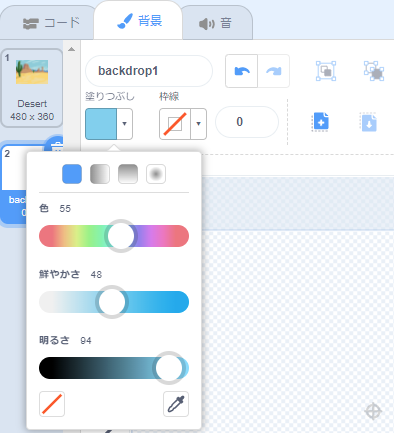
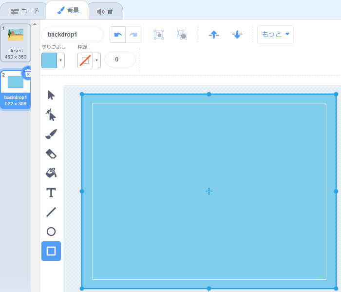

**背景を選ぶ**メニューをクリックして**描く**を選択します。

新しい背景が強調表示されたScratchペイントエディタが表示されます。 プロジェクトに他の背景がある場合は、それらもリストに表示されます。

背景キャンバス全体が表示されていることを確認してください。**ズームアウト**ツールを使用する必要があるかもしれません。

背景のメインカラーを設定するには、**四角形**ツールをクリックし、**塗りつぶし**色選択パネルを使用して色を選択します。

背景キャンバス全体を覆うように図形をドラッグします。

