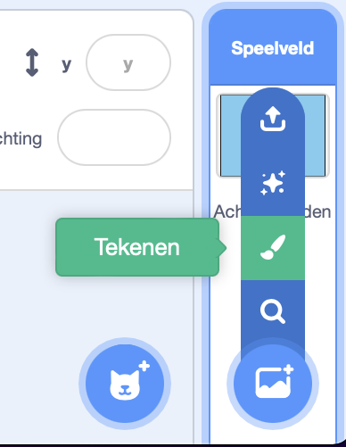
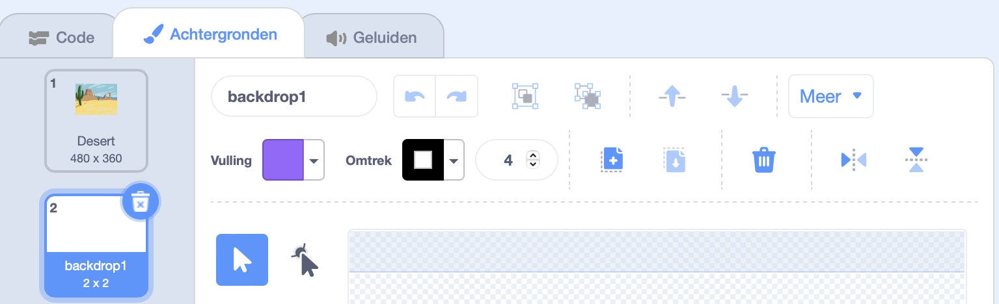
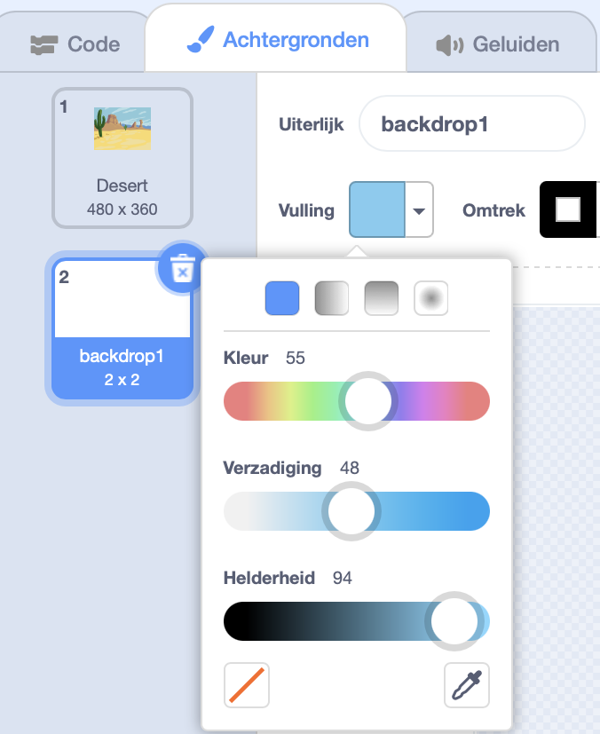
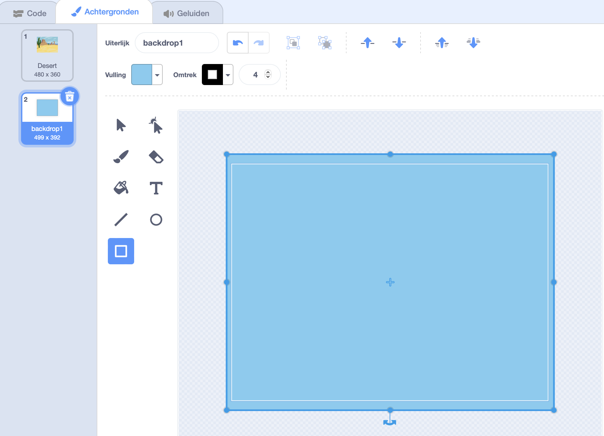

Klik op het menu **Kies een achtergrond** en selecteer **Tekenen**.

Je komt dan in de Scratch Teken-editor en de nieuwe achtergrond is gemarkeerd. Als je andere achtergronden in je project hebt, zul je deze ook in de lijst zien:

Zorg ervoor dat je het volledige canvas van de achtergrond kunt zien, daarvoor kun je de tool **Uitzoomen** gebruiken:

Om de hoofdkleur van de achtergrond in te stellen, klik je op het **Rechthoek** gereedschap en gebruik je vervolgens de **Vulling** kleurkiezer om een kleur te selecteren en sleep je de vorm over de volledige achtergrond:

Sleep de vorm over het volledige achtergrond canvas:

