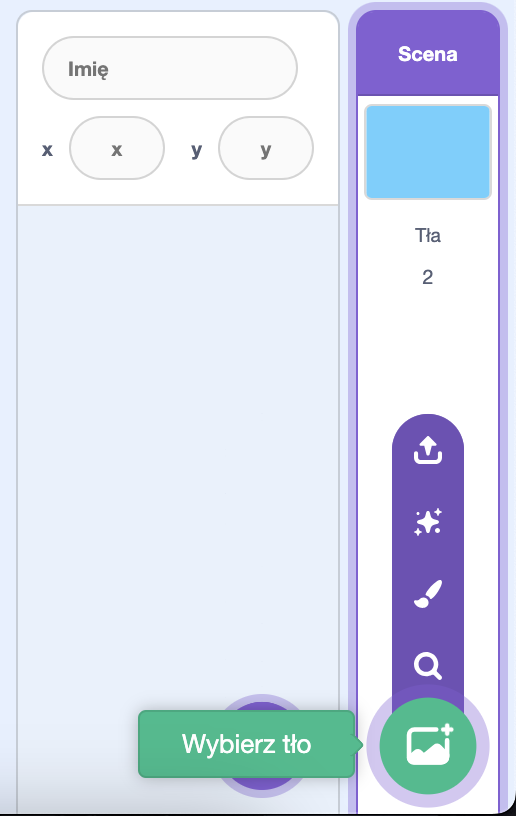
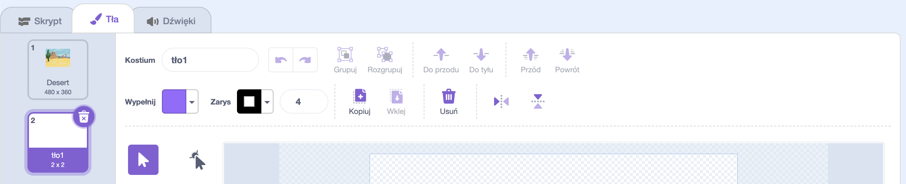
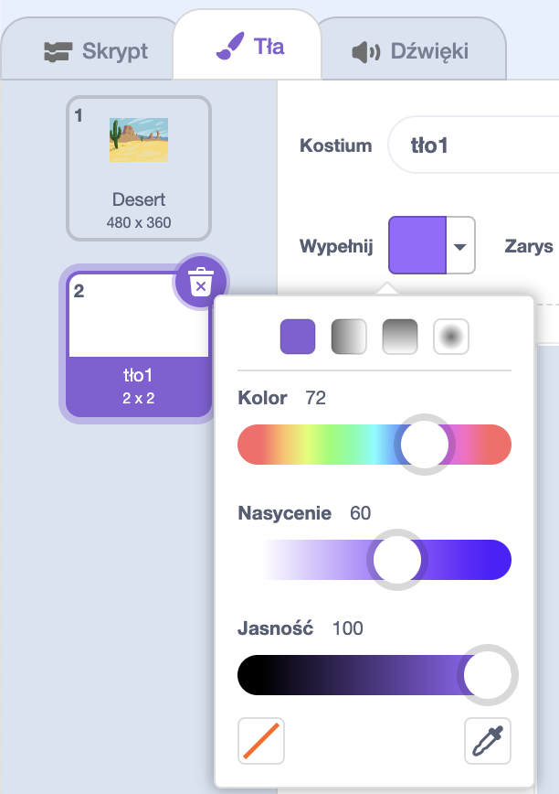
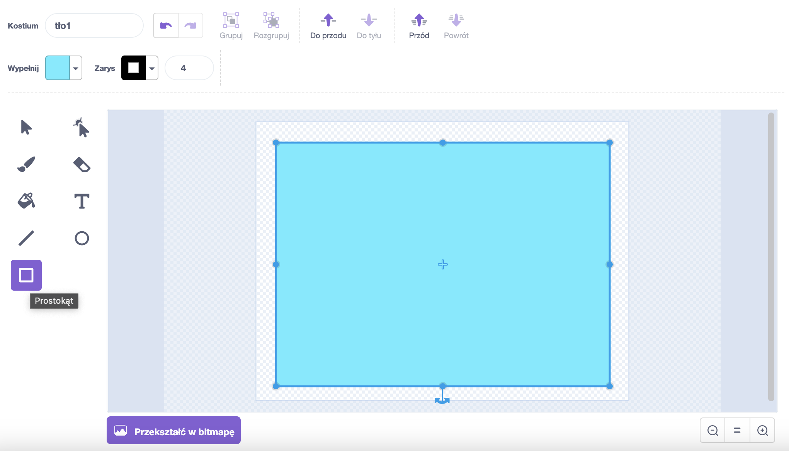

Przejdź do menu **Wybierz tło** i kliknij **Maluj**.

Zostaniesz przeniesiony do edytora Scratch Paint z podświetlonym nowym tłem. Jeśli w swoim projekcie masz inne tła, zobaczysz je również na liście:

Upewnij się, że widzisz całe płótno tła, konieczne może być użycie narzędzia **Pomniejsz**:

Aby ustawić główny kolor tła, kliknij narzędzie **Prostokąt**, a następnie użyj selektora kolorów **Wypełnienie**, aby wybrać kolor:

Przeciągnij kształt przez całe płótno:

