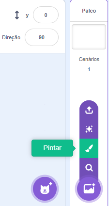
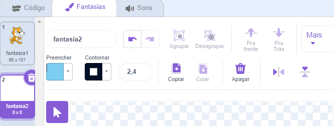
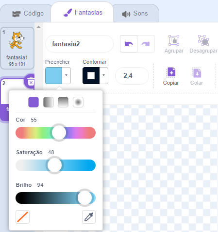
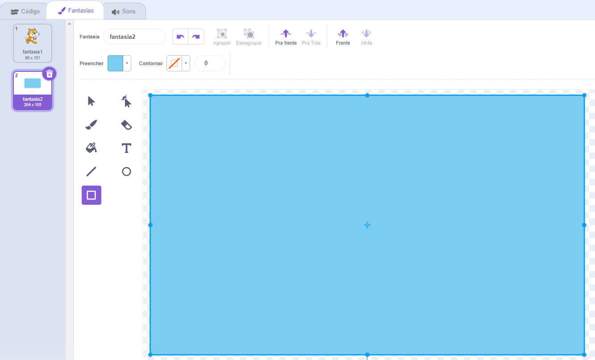

Vá para o menu **Selecionar Cenário** e clique em **Pintar**.

Você será levado ao editor de pintura Scratch com o novo cenário em destaque. Se você tiver outros cenários no seu projeto, também os verá na lista:

Certifique-se de ver a tela completa do cenário, talvez seja necessário usar a ferramenta **Zoom out**:

Para definir a cor principal do cenário, clique na ferramenta **Retângulo** e use o **Preencher** para selecionar uma cor, então arraste a forma sobre a tela inteira do cenário:

Arraste a forma sobre toda a tela do cenário:

