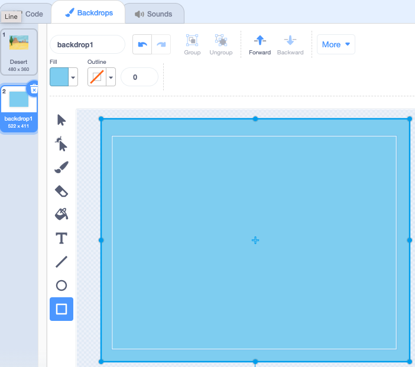

Click the **Choose a Backdrop** menu and select **Paint**.

You will be taken to the Scratch Paint editor with the new backdrop highlighted. If you have other backdrops in your project, you will also see them in the list:

Make sure you can see the full backdrop canvas, you might need to use the **Zoom out** tool:

To set the main colour of the backdrop, click on the **Rectangle** tool then use the **Fill** colour chooser to select a colour:

Drag the shape over the full backdrop canvas:

