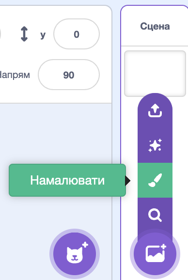
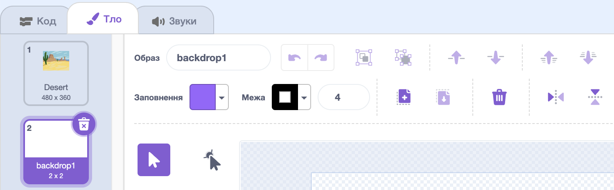
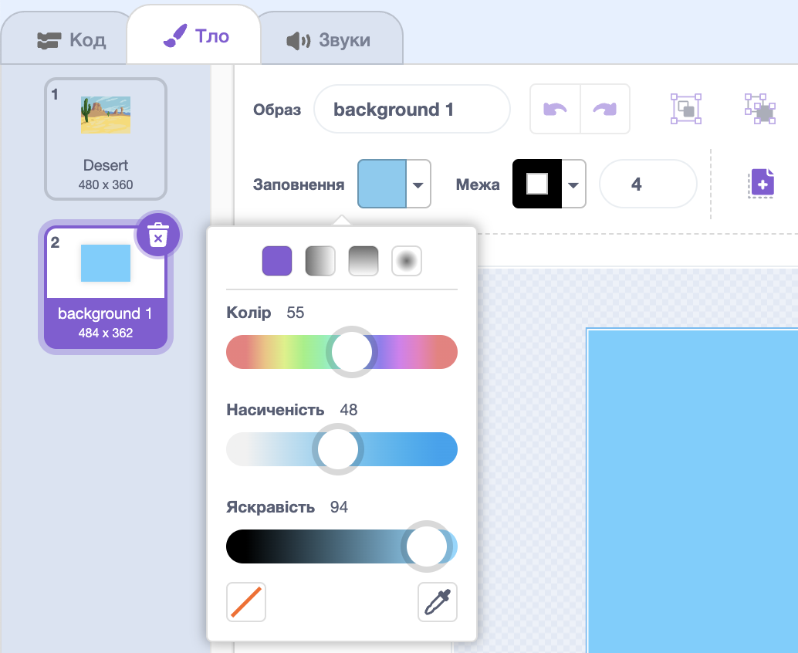
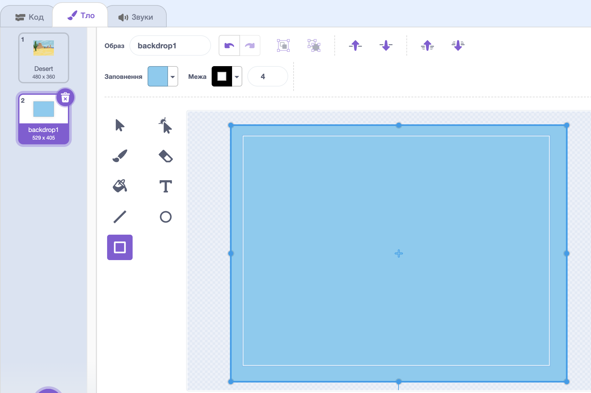

Клацни на меню **Обрати тло** і вибери **Намалювати**.

Ти перейдеш до редактора малювання Скретчу з виділеним новим тлом. Якщо у твоєму проєкті є інші тла, ти також побачиш їх у списку:

Переконайся, що ти бачиш увесь малюнок тла. Тобі може знадобитися інструмент **Збільшити/зменшити**:

Щоб задати основний колір тла, натисни на інструмент **Прямокутник**, потім за допомогою панелі вибору кольору **Заливки** вибери колір:

Розтягни фігуру на весь малюнок тла:

